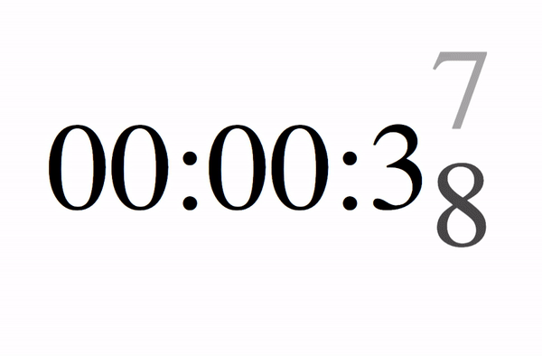

# 3D旋转效果计时器

主要使用 rotateX, translateZ 和 transform-style: preserve-3d

将每一个数字Z轴放大，3D空间中X轴旋转36deg

## 开始秒数计算

默认从 0 开始倒数

```html
<div>0</div>
<div>9</div>
<div>8</div>
<div>7</div>
<div>6</div>
<div>5</div>
<div>4</div>
<div>3</div>
<div>2</div>
<div>1</div>
```
```js
// second 从第几秒开始倒数
for (let index = 0; index < 10; index++) {
  let num = (second - index + 10) % 10;
  innerHTML += `<div>${num}</div>`;
}
```



[codeopen](https://codepen.io/claviering/pen/abdKgZm)

[Github](https://github.com/claviering/Front-End/tree/master/Timer)